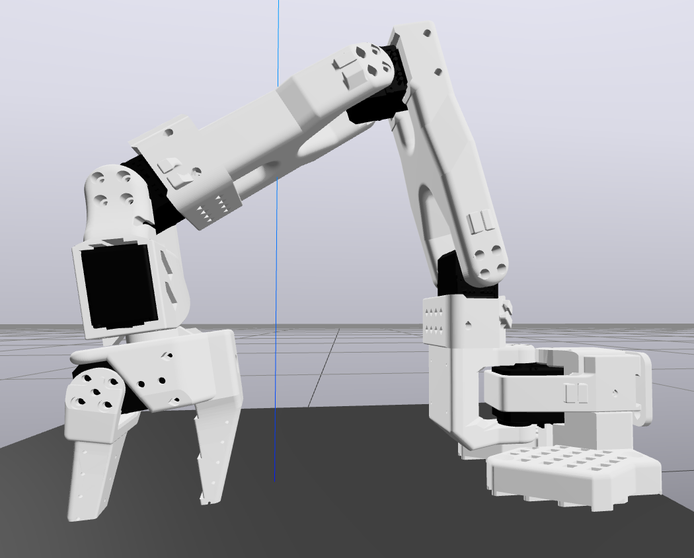
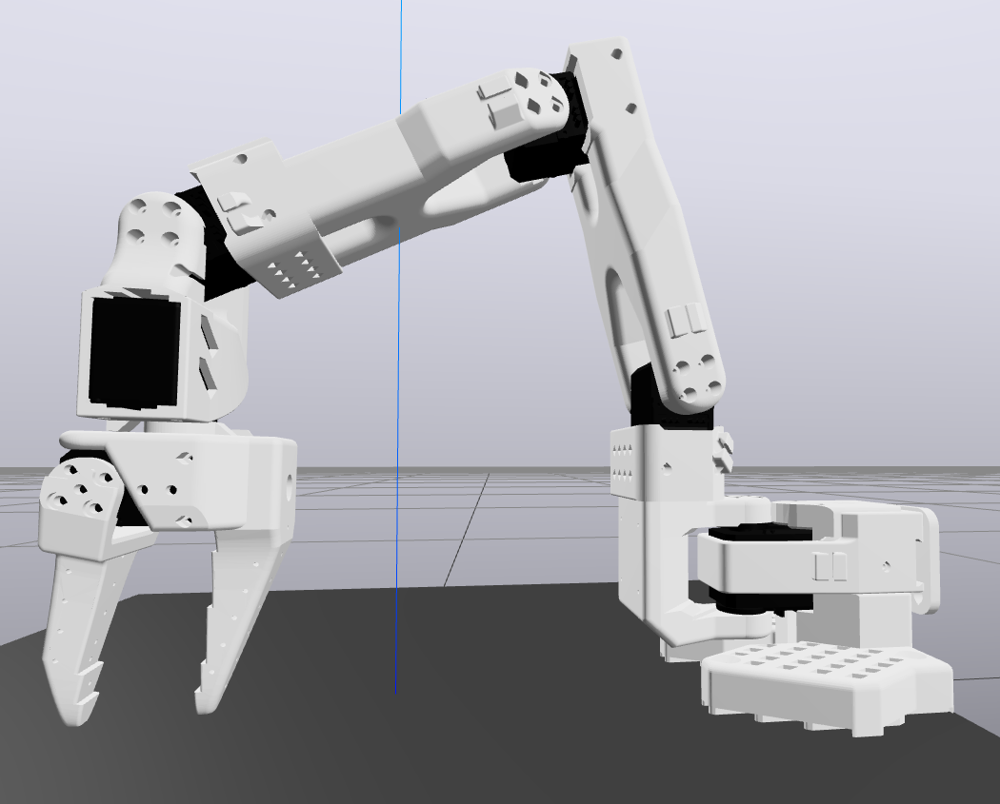

# SO-101 Motor Calibration

## Overview

When working with robot arms, accurate joint state estimation is necessary for executing precise manipulation tasks. The motors on the SO-101 follwer arm (the Feetech STS3215 C001) have a 12-bit position encoder, yielding a theoretical position precision of less than 0.1 degree. Unfortunately, when deployed in the SO-101 arm, some of the motors exhibit considerable encoder biases. For example, motor #3 associated with joint `elbow_flex` commonly exhibits a positive bias of over 3 degrees.

If these biases are left uncorrected, the SO-101 gripper's true position may end up several centimeters away from the commanded position, severely limiting task precision. The [official LeRobot calibration procedure](https://huggingface.co/docs/lerobot/so101#calibrate) attempts to address this, but unfortunately is not accurate enough (see figure below). This document introduces a revised motor calibration procedure for the SO-101 which improves end-effector positioning accuracy by up to an order of magnitude.

|  |  |
| :---: | :---: |
|  |  |
| *LeRobot calibration - gripper penetrates table by ~2cm* | *Revised calibration - gripper penetrates table by ~2mm* |

## Revised Calibration Procedure

The official LeRobot calibration procedure has the user move each joint to the limits of its range, where the raw encoder values are recorded. After this, whenever the robot is activated, the raw encoder values are "normalized" using the midpoint of the recorded joint limits. This method is valid if every joint's range is symmetrical, i.e. `abs(lower_limit) = abs(upper_limit)`.

However, the SO-101 has enough asymmetry in its joint ranges to render the above approach inaccurate. A better approach would be to take the recorded joint limits and register them against the real joint limits obtained from the robot's physical model. Unfortunately, the joint limits provided in the default SO-101 URDF appear to be rough "eyeball" approximations. Fortunately, more accurate joint limits can be obtained through careful physics simulations using the provided body meshes: see [`/docs/URDF.md`](./URDF.md#improve-joint-limits) for details. 

After accurate ground-truth joint limits have been obtained, optimal motor biases can be calculated using the following formula:

$L_{true}$ : True lower limit (from URDF) \
$L_{meas}$ : Measured lower limit (from calibration) \
$U_{true}$ : True upper limit (from URDF) \
$U_{meas}$ : Measured upper limit (from calibration)

$$Bias = \frac{(L_{true} - L_{meas}) + (U_{true} - U_{meas})}{2}$$

See [`calc_biases.py`](../scripts/calc_biases.py) to automatically perform this calculation for the SO-101.

## Visualization

The script [`state_publisher.py`](../scripts/state_publisher.py) reads raw encoder values from the SO-101 follower arm at 10Hz, applies the calibration described in [Revised Calibration Procedure](#revised-calibration-procedure), and publishes the bias-corrected joint positions to an LCM channel called `SO101_STATUS`.

The notebook [`state_viewer.ipynb`](../examples/state_viewer.ipynb) establishes an LCM subscriber in Drake on the `SO101_STATUS` channel and sends the results to the `SceneGraph`.

When the two scripts above are run simultaneously, the arm's current configuration can be visualized in meshcat (see [figure above](#overview)).
