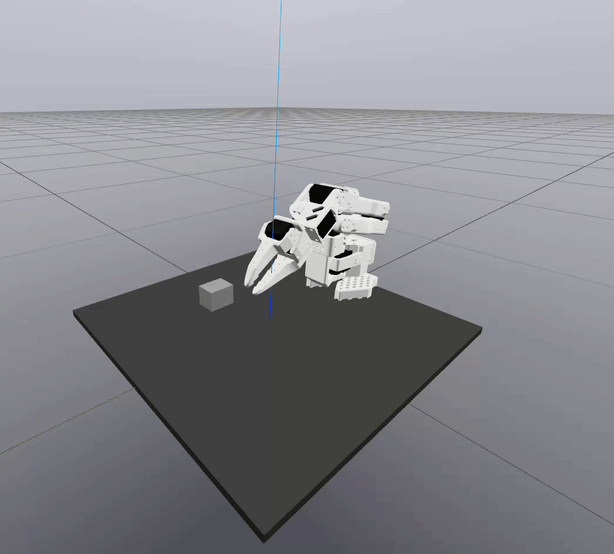
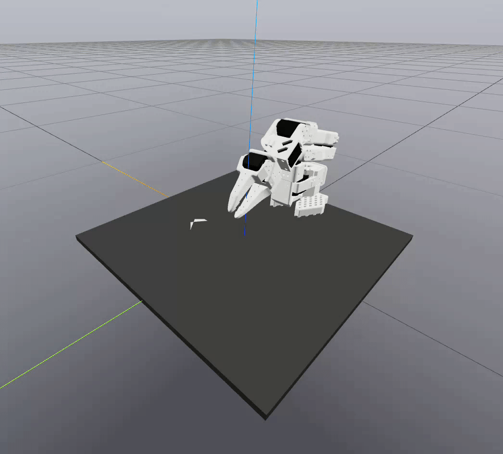
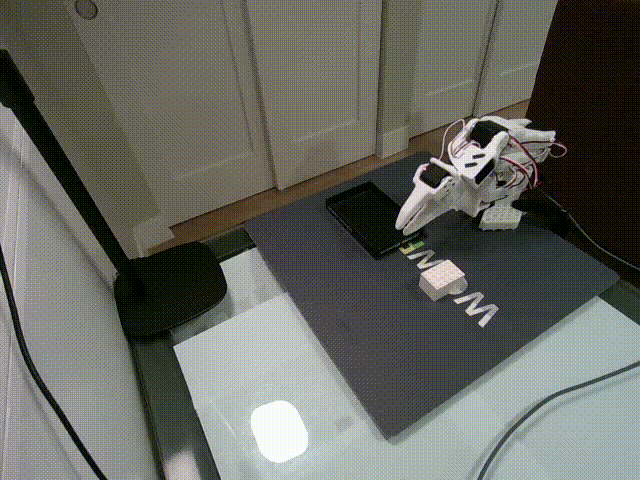

# SO-101 Drake Hardware Integration

This document describes the integration required to visualize and control the SO-101 hardware using Drake

## Overview

As a motivating example, a LEGO block with known shape and pose was picked and placed into a bin.

For simplicity, the motion control algorithm chosen was unconstrained Diff-IK. Task keyframes were manually chosen so as to avoid joint limits and singularities. The closed-loop Diff-IK policy was combined with simple open-loop helper trajectories in joint space for opening/closing the gripper finger and moving the arm from "rest" position to "ready" position and back.

|  |  |  |
| :---: | :---: | :---: |
|  |  |  |
| *Offline Simulation* | *Online Digital Twin* | *Real Hardware* |

## Drake Integration

To visualize and control the SO-101 state with Drake, ideally `MakeHardwareStation` would be used with `hardware=True`. Unfortunately, this helper function appears only to be useable with the Kuka iiwa and Schunk WSG hardware at this time. Fortunately, it is simple enough manually adapt `MakeHardwareStation` to the SO-101 hardware. See the **Perform Task On Hardware** section of [`/examples/hardware.ipynb`](../examples/hardware.ipynb) for an example implementation.

At a high level, an `LcmPublisherSystem` is established to send commands to the hardware, and an `LcmSubscriberSystem` is established to read the current configuration from the hardware. Desired states are sent to the command publisher by the trajectory sources mentioned in [Overview](#overview), and current states are received by the status subscriber and passed to the `SceneGraph` for digital-twin visualization.

## LeRobot Integration

The LeRobot API provides methods to send actions to and receive observations from the SO-101 hardware. The standard methods for doing so are `get_observation()` and `send_action()`. Unfortunately, due to the issues described in [`Calibration.md`](/docs/Calibration.md), these methods cannot be used on the SO-101 without incurring serious precision losses.

The solution is to perform and apply a custom calibration, and then manually send and receive raw encoder tick values using the `sync_read()` and `sync_write()` methods of the `FeetechMotorsBus` member. See [`/scripts/hardware_controller.py`](/scripts/hardware_controller.py) for an example implementation.

Finally, states can be sent to and received from Drake using simple LCM publishers and subscribers. For the subscriber, the queue capacity was set to `1` and handler timeout set to `2ms` in order to ensure only the latest desired state was maintained by the controller. 

## Sim-to-Real Transfer

When [hardware.ipynb](/examples/hardware.ipynb) and [hardware_controller.py](/scripts/hardware_controller.py) are run together, the SO-101 state can be fully visualized and controlled through Drake. At this point, after a manipulation task plan is assembled and verified in pure simulation, it can be evaluated on the real hardware.

An example of this transfer is displayed in [Overview](#overview). As the figure suggests, the hardware is able to successfully complete a relatively precise  pick-and-place task, but the trajectories are executed at roughly 70% of simulation speed, and the hardware exhibits considerably more shaking than in simulation.

The shaking can be partially resolved by commanding smoother and higher-speed trajectories, but the real solution lies in using higher-end motors with more sophisticated and better tuned motor controllers. However, for low-cost hardware such as the SO-101, the amount of shaking can be tolerated in most instances. 