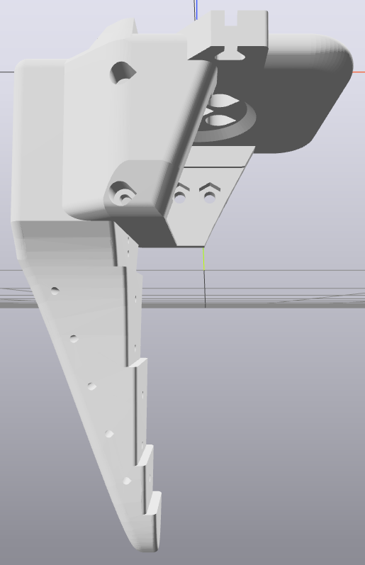
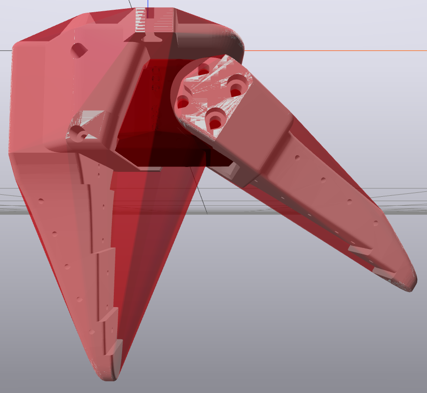
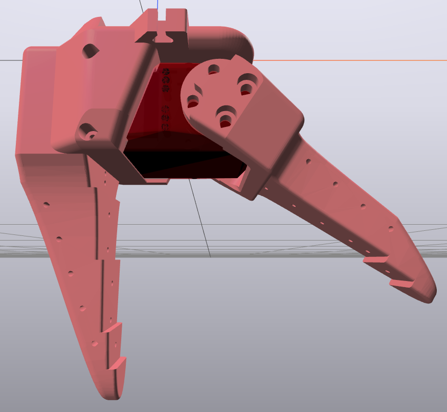
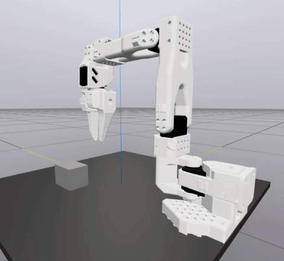
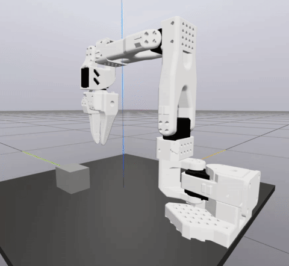

# SO-101 Drake Model

This document describes how the Drake-compatible URDF `so101_new_calib_drake.urdf` was prepared

(*apologies for the bad image formatting*)

## Source URDF

The source SO-101 URDF `so101_new_calib.urdf` and associated model assets can be obtained from [the project page](https://github.com/TheRobotStudio/SO-ARM100/tree/main/Simulation/SO101). They are copied here for convenience.

The source URDF is not compatible with Drake as-is. To make it compatible, run the `make_drake_compatible_model` utility as recommended on the [Drake troubleshooting page](https://drake.mit.edu/troubleshooting.html)

1. Activate environment \
`conda activate so101-drake`

2. Run utility \
`python -m manipulation.make_drake_compatible_model so101_new_calib.urdf {your filename here}.urdf`

## Modifications

Although the source URDF is parseable by Drake after running `make_drake_compatible_model`, a few augmentations are necessary to make it useable for manipulation in practice

### Enable Hydroelastic Collision Geometry

By default, Drake will approximate each collision geometry by its convex hull. This is problematic for `gripper_link` in the SO-101, which contains the L-shaped mesh `wrist_roll_follower_so101_v1` corresponding to the end effector's fixed finger: 

|  |  |
| :---: | :---: |
|  |  |
| *L-shaped finger mesh* | *Convex collision geometry* |

One solution is to break the L-shaped mesh into two rectangular components. However, it would be better to use the gripper mesh itself as the collision geometry. This can be accomplished by setting the collision geometry to rigid-hydroelastic (see [this tutorial](https://github.com/RobotLocomotion/drake/blob/master/tutorials/hydroelastic_contact_basics.ipynb) for details):

|  |
| :---: |
|  |
| *Non-convex collision geometry* |

The file `so101_new_calib_drake.urdf` uses rigid-hydroelastic collision geometry for both of the SO-101's gripper fingers.

### Configure Reflected Inertia

By default, Drake will not consider reflected motor inertia in dynamics calculations (see [the documentation](https://drake.mit.edu/doxygen_cxx/classdrake_1_1multibody_1_1_joint_actuator.html#reflected_inertia) for details). This is problematic for the SO-101 follower arm, whose six motors all use 345:1 gear reductions. If reflected inertia is left unmodeled, the arm is barely able to pick up a block weighing 1 gram:

|  |
| :---: |
|  |
| *Reflected inertia not modeled, fails to pick up 1 gram block* |

The solution is to configure the gear ratio and rotor inertia for each actuator. The datasheet for the Feetech STS3215 C001 does not specify rotor inertia, so a value of `2e-6` (used in `so101_new_calib_drake.urdf`) was empirically estimated in Drake (feel free to change this value to a more accurate number based on stronger findings or evidence). With reflected inertia accurately modeled, the arm is able to pick up a block weighing 400 grams (the maximum payload capacity of the SO-101):

|  |
| :---: |
|  |
| *Reflected inertia modeled, picks up 400 gram block* |